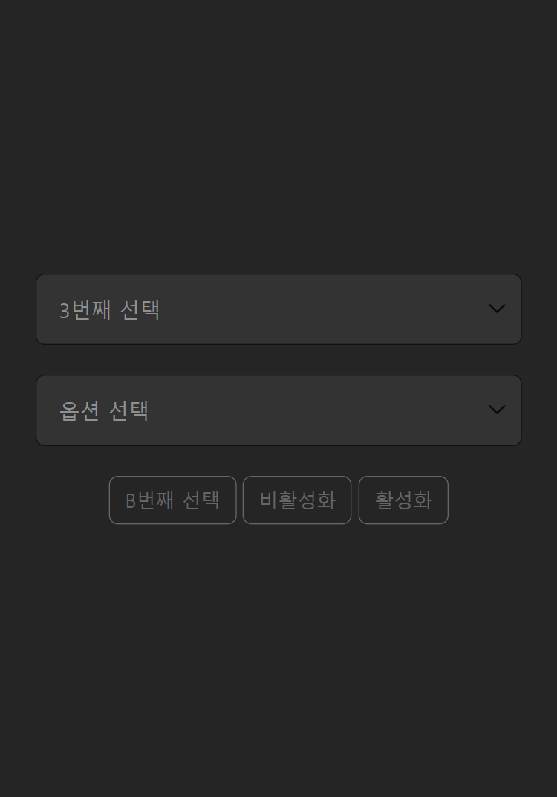

# select
swiper select

일하다 보면 이런거 만들어 달라는 사람 많이 만날거야. <br>
이거 가져다 써!   https://kimkee.github.io/select/<br>
쓰다 이슈 있으면 글 남기고...  https://github.com/kimkee/select/issues <br>
jQuery 쓰면 하도 지랄해서   javascript로 바꿔놨다

If you work, you'll meet a lot of people asking you to make this.<br>
You can get this sauce and write it.   https://kimkee.github.io/select/<br>
If you have any issues, please leave a comment  https://github.com/kimkee/select/issues <br>
I don't like using jQuery, so I changed it to javascript


<div style="max-width: 700px">
    <table cellpadding="0" cellspacing="0">
        <tbody>
            <tr>
                <td> </td>
                <td></td>
            </tr>
        </tbody>
    </table>
</div>

<!-- | 1 | 2 |
| :---: | :---: |
|  |  | -->


``` html
<span class="select-pop">
    <select class="slist" name="select_pop_1">
        <option value="val_0">옵션 선택</option>
        <option value="val_1" selected>1번째 선택</option>
        <option value="val_2">2번째 선택</option>
        <option value="val_3">3번째 선택</option>
        <option value="val_4">4번째 선택</option>
        <option value="val_5">5번째 선택</option>
        <option value="val_6">6번째 선택</option>
        <option value="val_7" disabled>7번째 비활성</option>
        <option value="val_8">8번째 선택</option>
    </select>
</span>
```

``` js
ui.popsel.set();
```

## 참조

- https://swiperjs.com/
- https://chat.openai.com/


